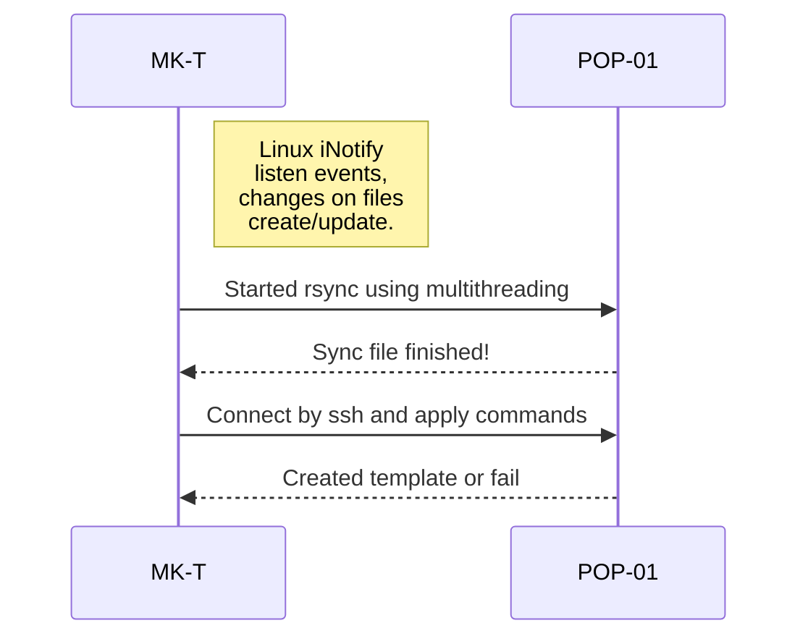

# MK Template

  

## Name
**MKTemplate** (Make templates for proxmox automatically)

  
## Description

Software to listen linux events (iNotify) and execute commands to push new data to all POPs and then connecting and create proxmox templates.

## Installation

Clone the repo and execute
```
pip install -r requirements.txt
python app/main.py --config /code/app/configs/config.yaml
```

## Usage

Connect to server where MKTemplate is running, connected to VPN run:

```
```

You need to have your ssh key pre-authorized by team leader.

```
@-mktemplate-mia-01:~$ ls cimgs/

```
You need to download the cloud image in qcow2 format from the internet, preferably from the official website, for example if we download the .qcow2 image of the VyOS distribution we will result in the following file.

```
vyos-1.3.3-cloud-init-10G-qemu.qcow2
```
A naming convention has been defined for the files, which is as follows:

**VMID_OSTYPE_VMNAME.EXT**

- VMID: The ID number that the template will have in the node

- OSTYPE: Specify guest operating system. This is used to enable special optimization/features for specific operating systems:

>**other**
unspecified OS
**wxp**
Microsoft Windows XP
**w2k**
Microsoft Windows 2000
**w2k3**
Microsoft Windows 2003
**w2k8**
Microsoft Windows 2008
**wvista**
Microsoft Windows Vista
**win7**
Microsoft Windows 7
**win8**
Microsoft Windows 8/2012/2012r2
**win10**
Microsoft Windows 10/2016/2019
**win11**
Microsoft Windows 11/2022
**l24**
Linux 2.4 Kernel
**l26**
Linux 2.6 - 6.X Kernel
**solaris**
Solaris/OpenSolaris/OpenIndiania kernel

 
- VMNAME: The name that the template will have

- FORMAT: The drive???s backing file???s data format.

>cloop | cow | qcow | qcow2 | qed | raw | vmdk

**WARNING!! You have to be careful, the file type must match this value.**

To start the procedure, just copy the new image using the following command. Once the copying is finished, the procedure will begin like the following diagram.

```
:~$ cp cimgs/8004_l26_Cirros.qcow2 apps/mktemplate/files/
``` 
New PVEs can be added in the following file, it is necessary that the destination PVEs previously have the authorized ssh key
```
-01:~$ vim apps/mktemplate/app/configs/config.yaml
```
Below is a production file
```
---

ssh_user: ""
ssh_pkey: "/code/app/configs/id_rsa"
cimgs_src_path: "/mnt/"

pves_list:
  - 17.7:22:/home/dmin/cimgs/
```

##  Diagrams

Brief summary of how the software works.


  
## Support
In the virtual machine you can see the service running in a container using the following command:
```
a-01:~$ docker ps | grep mk
2becae12bba0   registry.gitlab.:5000/devops/mk-template:latest   "python app/main.py ???"   7 days ago   Up 7 days   8000/tcp   mktemplate-mktemplate-1
```
Using the container ID we can review the logs.
```
-01:~$ docker logs -f 2becae12bba0
```
## Roadmap

## Authors

Jorge Lopez (jorge.lopez@edgeuno.com)

## License

## Project status


